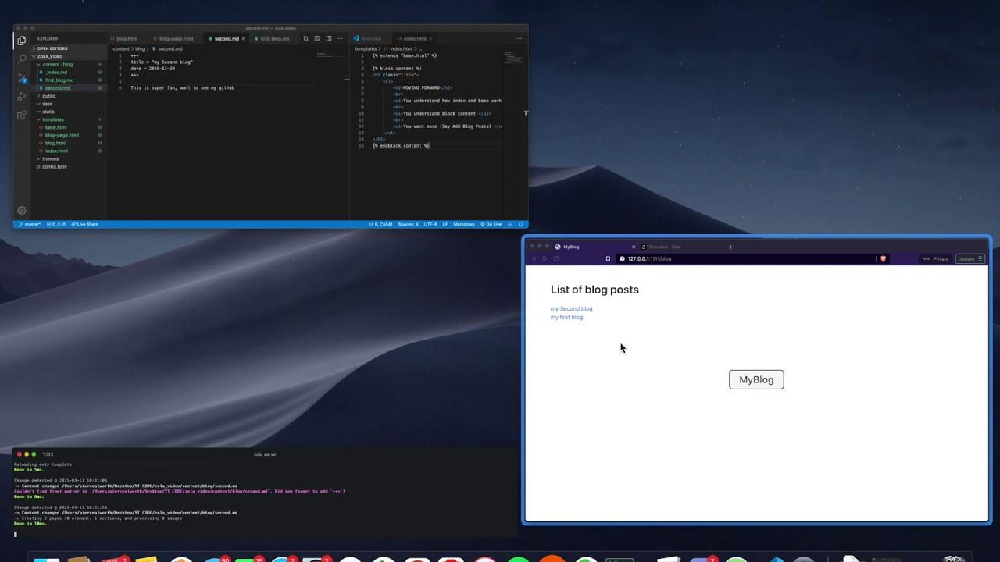

+++
title = "Build/Deply Static Website in 7 Minutes with Zola & Nelify!!"
date = "2025-11-04"
summary = "getzola.org"
tags = ["frontend", "html", "web", "zola", "css"]
author = "Pierce Alworth"

[extra]
youtube_url = "https://www.youtube.com/watch?v=h822l_XCo_k"
youtube_id = "h822l_XCo_k"
channel_url = "https://www.youtube.com/channel/UCnBRU_cI7kza3Tgvz2ryE2A"
duration = 403
duration_formatted = "6m"
thumbnail = "asset.jpg"
audio = "asset.mp3"
view_count = 1448
like_count = 18
categories = ["People & Blogs"]
has_chapters = false
subtitles = true
+++

## 🎧 Listen to the Episode

<audio controls style="width: 100%;">
  <source src="asset.mp3" type="audio/mpeg">
  Your browser does not support the audio element.
</audio>

## 📊 Video Stats

- **Views**: 1,448
- **Likes**: 18
- **Duration**: 6m
- **Published**: 2021-03-11
- **Subtitles**: Available

## 🧭 Introduction
In today's digital age, having a professional online presence is crucial for individuals and businesses alike. A static website can be a great way to establish this presence, and with the right tools, it can be created and deployed quickly. The video "Build/Deploy Static Website in 7 Minutes with Zola & Netlify" by Pierce Alworth showcases how to achieve this using Zola and Netlify. In this article, we will break down the key steps and concepts covered in the video, providing a comprehensive guide on how to create and deploy a static website using these tools.

The video covers the basics of setting up a Zola project, creating a static website, and deploying it to Netlify. Zola is a static site generator that allows users to create fast and scalable websites, while Netlify is a platform that enables easy deployment and hosting of these websites. By following along with the video and this article, readers will learn how to create a basic static website, add blog functionality, and deploy it to Netlify.

In this article, we will delve into the step-by-step process of creating and deploying a static website using Zola and Netlify. We will cover the key concepts and provide actionable takeaways, as well as discuss practical use cases and scenarios where this knowledge can be applied. Whether you're a developer, a blogger, or simply looking to establish an online presence, this article will provide you with the knowledge and skills needed to create and deploy a professional-looking static website.

## 🔍 Step-by-Step Breakdown
Here are the main steps involved in creating and deploying a static website using Zola and Netlify:
1. **Install Zola and create a new project**: The first step is to install Zola using Homebrew and create a new project using the `zola init` command. This will prompt the user with some questions, but these can be easily changed later.
2. **Create a base template and index file**: The next step is to create a `base.html` file in the templates folder and an `index.html` file that extends the base template. This is where the content for the homepage will be added.
3. **Add blog functionality**: To add blog functionality, a new folder called `blog` is created in the content folder, and a new file called `_index.md` is added to this folder. This file creates a structure for both the collection of blog posts and single blog posts.
4. **Create templates for blog posts**: Two new templates are created in the templates folder: `blog.html` for the collection of blog posts and `blog_page.html` for single blog posts.
5. **Create a blog post**: A new file called `blog.md` is created in the blog folder, and some sample text is added to it. This will create a new blog post that can be viewed on the website.
6. **Deploy the website to Netlify**: Finally, the website is deployed to Netlify using the `zola build` command and then pushing the code to GitHub. Netlify is then used to deploy the website, and it will be live in a matter of minutes.

## 💡 Key Insights & Best Practices
Here are some key insights and best practices to keep in mind when creating and deploying a static website using Zola and Netlify:
* **Use templates to separate content and layout**: Zola is all about creating templates and then using other files to populate those templates. This makes it easy to separate content and layout, making it easier to manage and update the website.
* **Use Markdown for blog posts**: Zola supports Markdown, making it easy to create and edit blog posts without needing to know HTML or CSS.
* **Use Netlify for easy deployment**: Netlify makes it easy to deploy a static website, and it integrates well with GitHub, making it easy to manage and update the website.
* **Keep the website simple and fast**: Static websites are fast and scalable, making them ideal for simple websites and blogs.
* **Use Zola's built-in features**: Zola has many built-in features, such as support for multiple languages and automatic generation of RSS feeds, that can make it easier to create and manage a website.
* **Test the website locally**: Before deploying the website to Netlify, it's a good idea to test it locally using the `zola serve` command to make sure everything is working as expected.
* **Use a consistent naming convention**: When creating files and folders, it's a good idea to use a consistent naming convention to make it easier to manage and update the website.

## 🎯 When to Apply This
This knowledge can be applied in a variety of practical use cases, such as creating a personal blog or portfolio website, a company website, or a website for a small business. Anyone looking to establish an online presence or create a simple website can benefit from using Zola and Netlify. This is especially useful for developers, bloggers, and small business owners who want to create a professional-looking website without needing to know a lot of code or have a lot of technical expertise. By following the steps and concepts outlined in this article, anyone can create and deploy a static website using Zola and Netlify, and have a professional-looking online presence in a matter of minutes.

## 🗒️ Full Transcript

Click to expand complete transcript

This is a real brief guide on how to use Zola to build a static website. I recommend you pull up getzola.org and follow along. So after using homebrew to install Zola, we're going to make a new directory to work in. I'm calling mine Zola video. Then we're going to do zola init in our directory. You'll be prompted with some questions, but just click enter through all of them as you can easily change those settings later. Initialize this repository using GitHub, make some commits, and then open up your text editor. I'm using VS Code, but you of course can use whatever you want. Quick note, use the command zola serve to fire up the website locally. To begin, create a new file called base.html in the templates folder. We're also going to make an index.html which extends base. This is where we're going to put our content we want shown on our homepage. Specifically, the HTML within the content block is displayed on our homepage according to base.html's configuration. Use HTML is our homepage template, while index HTML is where we input our homepage content we want displayed. So we have a static website. Now let's add some blog post functionality. In our content folder we going to add a new folder called blog and a new file called underscore index dot md to this folder This file creates a structure for both the collection of blog posts and single blog posts Moving back to the templates folder, we're going to create two templates, one called blog. This is for the collection of blogs like the entire list the other one we're going to create is going to be called blog page dot HTML this is going to be the template for the single blog pages alrighty now we're ready to make our first blog post back up in the blog folder we're going to create a file called blog MD populate it with some great text and see if it works so we're at our list of blogs and we can see my first blog did pop up so we'll go ahead and click on that Oh beautiful so we now have some blog functionality go ahead and make another one real quick right here. Okay so now let's add some buttons to our home page, maybe one to blogs, another to my GitHub. Nice good stuff Okay so now that we got our static homepage and blog functionality down there a couple things I kind of want to hammer home Zello is all about creating templates and then using other files to populate those templates. So whether that be the homepage right here, we're talking about base being the template and index being where we put in all our good stuff. Or if we're going to go over to the blog section, underscore index.md almost creates like a model or something of the type for our single blogs. But it's actually going to be our blog.html, what we're looking at right now, or our blog page dot HTML, which are the templates for the specific blog posts. So pretty easy. We can just type out blog posts in Markdown, which is fun. And then we can render them out using our templates. And if we want to change the style on all our blogs, we just go to blog page HTML, add some code, and there it is on all of them. So now let's take a second to talk about how the URL and routing stuff works in Zello. So all our blogs are going to be prefixed by slash blog slash because that is what our folder is called under content Then the actual URL for the individual blogs is going to be the file name of the blog post that you put in your code. basically blogs is our content type to access the list of blogs go to slash blogs and then for each individual blog go to the name of that blog file all righty now let's deploy this thing so in your command line you're going to run zola build and then you're going to push all this to GitHub. I'm assuming that you guys are all familiar with GitHub. So yeah, you are going to need a NetFly account. That's actually how I... Nellify? Nellify. A Nellify account, that is how we are going to be deploying it here. So assuming you have that all hooked up with GitHub, the process is insanely painless. So you're going to go to your Nellify. from there you're just going to click new site from git from there make sure you've authorized nullify with github and then you're going to have to search for your repository once you find it you just click on it click deploy site it's really that easy folks it's really that easy you

## ▶️ Watch the Video

<iframe width="560" height="315" src="https://www.youtube.com/embed/h822l_XCo_k" title="YouTube video player" frameborder="0" allow="accelerometer; autoplay; clipboard-write; encrypted-media; gyroscope; picture-in-picture; web-share" referrerpolicy="strict-origin-when-cross-origin" allowfullscreen></iframe>

[🎥 Watch on YouTube](https://www.youtube.com/watch?v=h822l_XCo_k) | [📺 Visit Channel](https://www.youtube.com/channel/UCnBRU_cI7kza3Tgvz2ryE2A)

---

*This post was automatically generated from the video content. Video by Pierce Alworth.*
