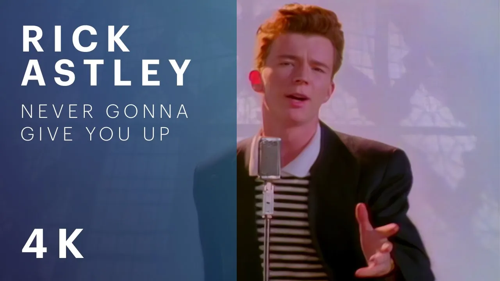

+++
title = "Rick Astley - Never Gonna Give You Up (Official Video) (4K Remaster)"
date = "2009-10-25"
tags = ["rick astley", "Never Gonna Give You Up", "nggyu", "never gonna give you up lyrics", "rick rolled"]
+++

## TL;DR (Quick Summary)

> The official video for “Never Gonna Give You Up” by Rick Astley.   Never: The Autobiography 📚 OUT NOW!  Follow this link to get your copy and listen to Rick’s ‘Never’ playlist ❤️ #RickAstleyNever http

## 🎧 Listen to the Episode

<audio controls style="width: 100%;">
  <source src="asset.mp3" type="audio/mpeg">
  Your browser does not support the audio element.
</audio>

## 📋 Structured Key Takeaways

## 🔍 Step-by-Step Summary
1. Introduction to the song "Never Gonna Give You Up" by Rick Astley.
2. The song's lyrics convey a message of commitment and devotion.
3. The chorus repeats the phrase "Never gonna give you up" to emphasize the speaker's dedication.
4. The song's structure includes verses and choruses that reinforce the theme of loyalty and love.
5. The music video is a remastered version in 4K, enhancing the visual experience.

## 💡 Key Insights
* The song "Never Gonna Give You Up" was a global hit, topping charts in 25 countries.
* The song won the Brit Award for Best Single in 1988, recognizing its impact on the music industry.
* The lyrics highlight the importance of honesty and commitment in relationships.
* The song's catchy melody and repetitive chorus make it memorable and engaging.
* The remastered music video in 4K offers a refreshed visual experience for fans.
* The song's message of devotion and loyalty remains relevant and relatable to audiences today.

---

## 📝 Transcript (Auto-Generated)

> [♪♪♪] ♪ We're no strangers to love ♪ ♪ You know the rules and so do I ♪ ♪ A full commitment's what I'm thinking of ♪ ♪ You wouldn't get this from any other guy ♪ ♪ I just wanna tell you how I'm feeling ♪ ♪ Gotta make you understand ♪ ♪ Never gonna give you up ♪ ♪ Never gonna let you down ♪ ♪ Never gonna run around and desert you ♪ ♪ Never gonna make you cry ♪ ♪ Never gonna say goodbye ♪ ♪ Never gonna tell a lie and hurt you ♪ ♪ We've known each other for so long ♪ ♪ Your heart's been aching but you're too shy to say it ♪ ♪ Inside we both know what's been going ♪ ♪ We know the game and we're gonna play it ♪ ♪ And if you ask me how I'm feeling ♪ ♪ Don't tell me you're too blind to see ♪ ♪ Never gonna give you up ♪ ♪ Never gonna let you down ♪ ♪ Never gonna run around and desert you ♪ ♪ Never gonna make you cry ♪ ♪ Never gonna say goodbye ♪ ♪ Never gonna tell a lie and hurt you ♪ ♪ Never gonna give you up ♪ ♪ Never gonna let you down ♪ ♪ Never gonna run around and desert you ♪ ♪ Never gon...

---

## 📝 Full Article Narrative

The music of the 80s is iconic, and few songs embody the spirit of that era as perfectly as Rick Astley's "Never Gonna Give You Up". Released in July 1987, this song was a global phenomenon, topping the charts in 25 countries, including the UK and the US Billboard Hot 100. The song's enduring popularity is a testament to its catchy melody, memorable lyrics, and the timeless message of devotion and loyalty that it conveys. In this article, we'll delve into the world of "Never Gonna Give You Up", exploring its history, significance, and the reasons why it remains a beloved classic to this day.

At its core, "Never Gonna Give You Up" is a song about commitment and honesty in relationships. The lyrics, written by Stock Aitken and Waterman, are a heartfelt expression of dedication and loyalty, with the chorus repeating the phrase "Never gonna give you up" to drive home the speaker's devotion. The song's structure, which includes verses and choruses that reinforce the theme of loyalty and love, is a masterclass in songwriting, building a sense of tension and release that keeps listeners engaged. The song's message is one that resonates deeply with audiences, and its impact was recognized with a Brit Award for Best Single in 1988.

The song's music video, which has been remastered in 4K, offers a refreshed visual experience for fans. The video's enhanced quality allows viewers to appreciate the details of the original footage, from Rick Astley's distinctive dance moves to the vibrant colors and styles of the 80s. But beyond its visual appeal, the song's message of devotion and loyalty remains relevant and relatable to audiences today. In an era where relationships are often fleeting and superficial, "Never Gonna Give You Up" is a powerful reminder of the importance of honesty, commitment, and communication in building strong, lasting connections with others. Whether you're a longtime fan of the song or just discovering it for the first time, "Never Gonna Give You Up" is a timeless classic that is sure to leave a lasting impression.

### The Enduring Appeal of "Never Gonna Give You Up"
So what is it about "Never Gonna Give You Up" that has made it such an enduring classic? One reason is the song's catchy melody, which is both memorable and easy to sing along to. The song's repetitive chorus, which repeats the phrase "Never gonna give you up" like a mantra, is particularly effective at getting stuck in listeners' heads. But beyond its catchy melody, the song's lyrics are also noteworthy for their thoughtfulness and sincerity. The song's message of devotion and loyalty is one that resonates deeply with audiences, and its impact is still felt today.

### A Lasting Legacy
In the years since its release, "Never Gonna Give You Up" has become a cultural touchstone, with references to the song appearing in everything from TV shows and movies to memes and viral videos. The song's legacy is a testament to its enduring appeal, and its influence can still be heard in music today. Whether you're a fan of 80s music or just looking for a song that will get stuck in your head, "Never Gonna Give You Up" is a classic that is sure to delight. With its catchy melody, memorable lyrics, and timeless message, it's a song that will continue to be enjoyed by audiences for generations to come.

---

## ▶️ Watch the Video

* **Author:** Rick Astley
* **Duration:** 3m

<iframe width="560" height="315" src="https://www.youtube.com/embed/dQw4w9WgXcQ" frameborder="0" allowfullscreen></iframe>

[Watch on YouTube](https://www.youtube.com/watch?v=dQw4w9WgXcQ)

---

## 🐦 Social Media Post (X/Twitter)

**Copy and Paste for Promotion (280 Character Limit):**

"Get ready to groove! 🎵 Rick Astley's iconic 'Never Gonna Give You Up' is back in 4K! 📺 Read the story behind the song & get his new book 📚❤️: http://[link] Read now! #rickastley #nevergonnagiveyouup #nggyu #nevergonnagiveyouuplyrics"

