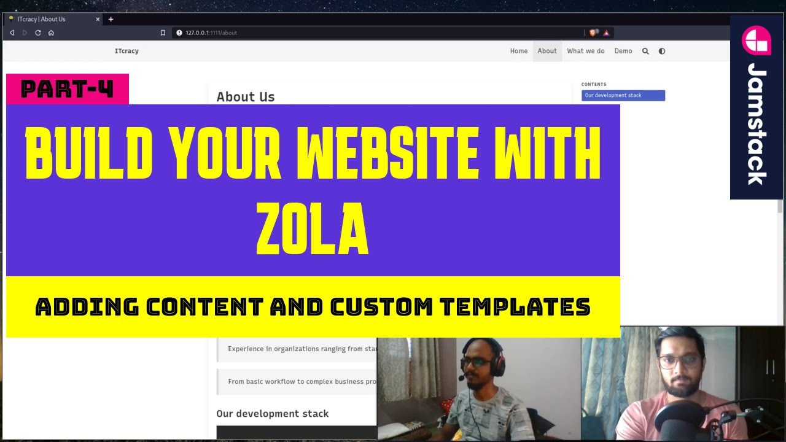

+++
title = "Zola tutorial #4: Adding content and custom templates | Static site generator | Jamstack"
date = "2025-11-03"
tags = [ "zola", "jamstack", "staticsitegenerator", "itcracy", "tera",]

[extra]
youtube_id = "a396bhOCnVc"
+++

## TL;DR (Quick Summary)

> In this lesson we will learn about adding section and normal pages to our website along with a simple example of custom template.

## 🎧 Listen to the Episode

<audio controls style="width: 100%;">
  <source src="./asset.mp3" type="audio/mpeg">
  Your browser does not support the audio element.
</audio>

## 📋 Structured Key Takeaways

## 🔍 Step-by-Step Summary
1. Recap of previous lessons and introduction to adding content and custom templates in Zola.
2. Using variables in the config file to change the website's content, such as the center image.
3. Adding normal pages to the website, either by creating a file named after the page (e.g., about.md) or by creating a folder with an index.md file.
4. Creating section pages, which list normal pages, by creating a directory with an _index.md file.
5. Customizing the theme by modifying template files to change the display of certain elements.

## 💡 Key Insights
* Zola allows the use of variables in the config file to customize the website's content.
* There are two ways to add normal pages: creating a file with the page name or creating a folder with an index.md file.
* Section pages are created by making a directory with an _index.md file and are used to list normal pages.
* Custom templates can be used to modify the display of certain elements on the website.
* To modify the theme, it's recommended to copy the template file and edit it in the templates directory, rather than modifying it directly in the theme directory.

---

## 🗒️ Transcript (Auto-Generated)

> hey friends how you doing until now we saw how to configure our website how to add content to our home page that is some text and we also saw the directory structure of the website if you haven't watched our previous videos do watch it for better understanding and if you see the website we have made few changes to it we have changed the text on the home page you can see that the team specializing in and we have also changed the center image to our itc logo and we have added some navbar items now for that for changing the logo that is the center image to change the center image what we have to do is we have to change the value of a variable which is inside our config.toml file so what happens is inside config.toml you can have different variables which you can use in your pages and how to use that we are going to look when we talk about templates so just see there is a variable defined in our config.toml which is avatar and it has the path to our image that is named as idgracy underscore logo.png and the path is starting from images so how to derive this path for that we have to take a look at a static directory and if you see inside static directory there are two folders one is icons and other images so in our case the path is starting from images so whatever you have inside static directory you can directly refer to it so in our case it is images so you can directly refer to slash images and inside that the file that you have so static becomes your root of the page and likewise similarly uh we have also changed the like we have added extra items over navbar previously we added about and now we have added what we do and demo and previously when we clicked on about we saw that we used to get a 404 page but now we have added a page actual page to it so when when we click on about we get this page and how this page appears is by two ways basically there are so there are two ways through which you can make this page appear first way is inside your content you can add a file named as about and add all your content inside the about.md and that will be replicated that will be seen when you click the about page so you can directly add about.md and that can be seen here so the url is about and the other a second way that we have chosen or what that we love is adding a folder by the name of the page so in our case we have added a folder by the name about and inside that to add content we have to add a index.md file whatever content you see here on the about page is this content so there are few variables enclosed in triple pluses some of which are by default variables provided by zola so if you see title discussion date they are default variables which zola provides and if you want your own variables if user wants to define their variables they can have it under the extra section so in this case in this theme deep thought toc is a extra variable that is a user defined variable and below that that is after the triple process you see the actual markdown content there is an image defined by the syntax if you see here it is about underscore hero dot png and other stuff this is basically markdown content which appears over here and for markdown you can refer to the link in the description it's very simple and you will get the entire structure in no time like entire syntax in no time now as i said there are two ways one is you can directly add about dot md and the second one is you can have a folder named as above now Now, why did we choose the second image? Because we wanted to have more grouping of the image to our content. In our case, if you see, we have about underscore automation dot png and about underscore hero dot png in the same folder where the about page is index dot md or inside the about directory So what happens is if you have images in your about folder inside content you can access them directly by their name so you don't have to give uh like in the previous case slash images slash or a path starting from the static you can directly use the name of the images which we have used in the index.md page you can see it is about underscore hero.png so you can directly access these variables and this also allows to proper grouping of your content in one folder so that's why we use this second can we all right we also added a new navbar item other than about which was what we do and if i click on it you'll see this kind of page and this is different from the one that you've seen about because it's a normal page with some content in it this is a normal page in zola but the what we do that we have created is not a normal one it's a section page so how it is different from a normal page is that the section page will list will list the normal pages so application development automation training these are our normal pages and if i click on them you'll see that it looks somewhat similar to the about page that we had and a section page lists these normal pages inside it so the it will list its children and how it is done we'll take a look if i go to our website directory and if i go to content you'll see we have a directory what we do now it is same as about we just created a directory you can in case of sections you cannot create a normal page like what we do dot md and use it because that will not behave like a section it will be a normal page like about that we saw so for section to work or for a section page you always need to create a directory like we have done here what we do and when you open it you see other file other folders same as the about one we'll take a look at them but before we have to look at the index.md but look carefully this is not just index.md it is underscore index.md so creating an underscore index.md tells sola that you want a section page okay so if i check the underscore index.md file we don't have any content in it we just have few variables inside the plus plus thingy and the variables are similar to what we had in about or any in any other page because these are just basic or default variables which zola provides so title description date paginated by just these two variables are special for section what do you say section pages it's not in not there in normal ones because normal pages do not list anything but section pages do list their children so you have some variables which help you to control how it is going to be listed so it will be sorted by date you can give a variable some value like we have we want it to be sorted by date and then you can paginate by phi zola provides pagination so by using this variable you can say that you want five in a page okay if we had more like if we had 100 in it then we will see five in the page and then the next and previous button and then you can uh traverse through them we can try that out by changing it to two or so so that we get to see yep I'll change it to two and it should refresh okay so uh our face is in between I'll just take it out you can see uh you get some pagination this pagination part or the UI of this pagination part is done by the theme that you have but Zola provides you the  what do you say the building blocks to create this pagination things okay we'll just create get it back to five so that we see all of them in a single page and if i click on one of them it will just open the child of what we do which was app development so if i go back to the directory you'll see we have app development directory and you can see in the url as well it says what we do and then app development so it is listing its children which are which three which are these three so if i go back you can see we have three children and each of them are corresponding to these folders and this folder is exactly what we saw with the about uh about page so it's exactly similar to about one it has it has it is a folder which represents a normal page because it has normal index.md it's not underscore index.md it's just index.md and it has its related images so it's grouped properly so we can put the images related to that page inside the folder itself and all the content will be in a proper format and a proper structure okay now we'll take a look at a very simple example of how you can extend and modify your theme so what do i mean by that so so what have what if you don't like some part of how the website is displayed or some some things that you don't want that want to be there so for example we don't like this line it gracie published on and this thing we don't want these things to be displaced because it's just a normal uh section it's not some post or a blog that we have written. So we want to remove this. To do that, we will need to extend our theme and then modify it. So what I mean by that, it's very simple, don be afraid of modifying your theme because it very easy You just have to go to your themes directory and inside your theme and then go to templates and here is all the files that which which we are using to display our website right so these are the files which i used and i spoke we we spoke about about which is a normal page and then what we do which is a section page and you can see the same names over here you have a page.html you have a section.html so a section.html is used to display a section page and page.html is used to display a normal page so in our case we want to modify the section page we don't want to display these things so what you have to do is take the section.html open that you can directly edit this file as well but we don't recommend to do that because if you want to update your theme or if you want to like the theme that you're using if it has been updated in its repository and if you have you have some new things in that and you want that to be included in your website you if you modify here and then update it the your modification will be gone so what you can do is just copy this whole file the section html file and put that inside your templates directory so not inside the themes one your templates directory create a new file so in our case we have created non-post section dot html so what i did was copied the section dot html and create and added like pasted the contents here okay and if i scroll down we can, I think I already removed it. So this is the whole content that we copied from section.html from inside the theme that we had, deep thought theme. And the part which is displaying this thing I take receive published on and then this thing is you have to take a look at the html and then try to read and get see which part is being displayed by which part here and it is not not very difficult it's very easy as we can see that this macro or this div is displaying the page metadata and then this div is displaying the content metadata which is here you can try obviously try use the try and what do you say trial and error method we can we also did that we will delete this div also this div and then save this file and now if i refresh nothing is happening this is because we have extended the template from the theme and we created our own template but we have not uh instructed zola to use that template anywhere you have not instructed the what we do page to use the template that we have so what you have to do is go to the content directory that you had uh this is inside theme sorry let's go to it crazy go to your directory open the content and then go to what we do and underscore index dot md which we had created for the section page to appear you find that you have to open that and then zola provides a default variable which is template so this means that you can use any template in any page and you just have to give the template name to the page so i'll overwrite by saying i want to use the non section page dot html i think that was the name no it was non post dash section okay and we save it so what this means is that i want to use the non post section dot html which we have created inside our templates directory since this is a template and we have added inside our templates directory you don't have to give any path or anything you just have to give the name of the file that you have created inside the templates directory and i've done that if i go back this has refreshed and you see the row is now not coming up so this is a simple example how you can edit and extend your template from the theme and then make your own changes in the future video we'll also do some more modifications in the template so that you will understand how it works even in more depth also the same thing for about as well we saw that we had this row and we don't want it now this is not the section page right we cannot ask it to use this section template but we have already created a same non-post page which we copied from the themes directory templates we copied the page.html and then created this non-post page.html where we deleted that same divs that we saw and now all we have to do is go to our content directory inside about inside index dot MD, I have to give a variable called as template and then give the name of the file which is non post dash page dot HTML. If I leave if I save it, and it should be refreshed here. So you can see the that row is now gone. This is how you can add simple modifications or you can extend your templates will also So take a look at it in more in depth in the future videos. Just one thing. What do you know in the template that is the HTML files is a combination of HTML and Tara templating language, which we are also going to explore in the upcoming videos. Yep.

---

## 📝 Full Article Narrative

Introduction

In the world of web development, static site generators have become increasingly popular due to their speed, security, and ease of use. One such static site generator is Zola, a Rust-based tool that allows developers to build fast and scalable websites. In this article, we will explore how to add content and custom templates to a Zola website, using the ITcracy website as an example. We will delve into the process of creating normal pages, section pages, and customizing the theme to suit our needs.

The ITcracy website is a professional website built using Zola, and in this tutorial, we will learn how to add content to the website, including text, images, and navigation bars. We will also explore how to create custom templates to modify the display of certain elements on the website. Whether you are a beginner or an experienced developer, this article will provide you with a comprehensive guide on how to use Zola to build a professional website.

As we dive into the world of Zola, it's essential to understand the basics of the tool and how it works. Zola allows developers to create websites using Markdown files, which are then converted into HTML files. The tool also provides a range of features, including support for variables, custom templates, and themes. In this article, we will explore how to use these features to create a professional website.

### Adding Content to Zola

To add content to a Zola website, we need to create Markdown files that contain the text, images, and other elements that we want to display on the website. We can add normal pages to the website by creating a file named after the page, such as about.md, or by creating a folder with an index.md file. For example, if we want to create an about page, we can create a file named about.md and add our content to it. Alternatively, we can create a folder named about and add an index.md file to it, which will contain the content for the about page.

### Creating Section Pages

Section pages are used to list normal pages, and they are created by making a directory with an _index.md file. For example, if we want to create a section page for our what we do page, we can create a directory named what-we-do and add an _index.md file to it. The _index.md file will contain the content for the section page, and it will list the normal pages that are contained within the directory. We can also use variables to control how the section page is displayed, such as sorting the pages by date or paginating the content.

### Customizing the Theme

To customize the theme, we need to modify the template files that are used to display the website. We can do this by copying the template files from the theme directory and editing them in the templates directory. For example, if we want to modify the section page template, we can copy the section.html file from the theme directory and edit it in the templates directory. This will allow us to modify the display of the section page without affecting the rest of the website.

### Conclusion

In conclusion, adding content and custom templates to a Zola website is a straightforward process that requires a basic understanding of Markdown and HTML. By following the steps outlined in this article, developers can create professional websites using Zola, with custom templates and themes that suit their needs. Whether you are building a personal website or a commercial website, Zola provides a range of features and tools that make it an ideal choice for web development. With its speed, security, and ease of use, Zola is an excellent choice for anyone looking to build a fast and scalable website.

---

## ▶️ Watch the Video

* **Author:** ITcracy
* **Duration:** 16m

<iframe width="560" height="315" src="https://www.youtube.com/embed/a396bhOCnVc" frameborder="0" allowfullscreen></iframe>

[Watch on YouTube](https://www.youtube.com/watch?v=a396bhOCnVc)

---

## 🐦 Social Media Post (X/Twitter)

**Copy and Paste for Promotion (280 Character Limit):**

"Build a pro website with Zola! 🚀 Learn to add content & custom templates with our latest tutorial 📄💻. Read now & take your Jamstack skills to the next level! 👉 https://x.com #zola #jamstack #staticsitegenerator #itcracy"

